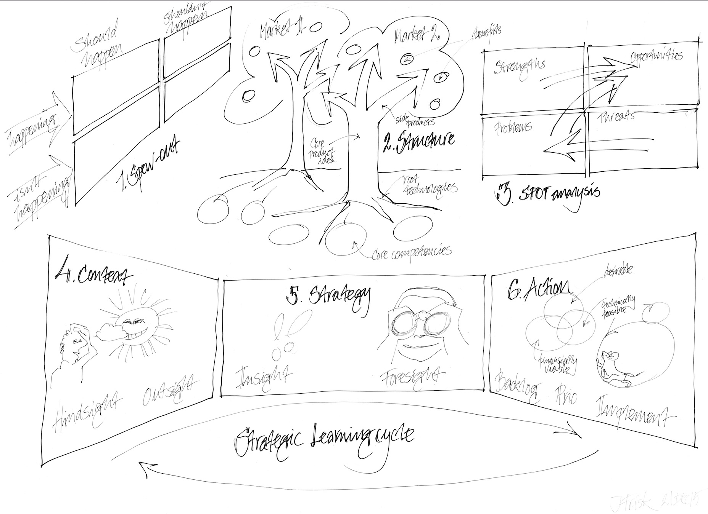
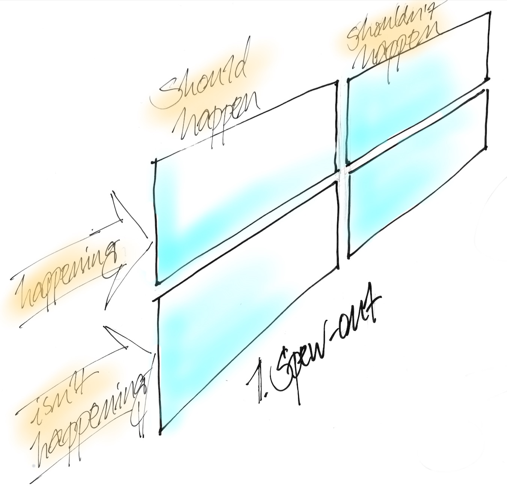
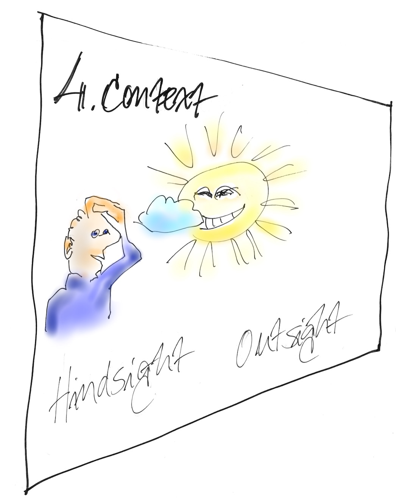
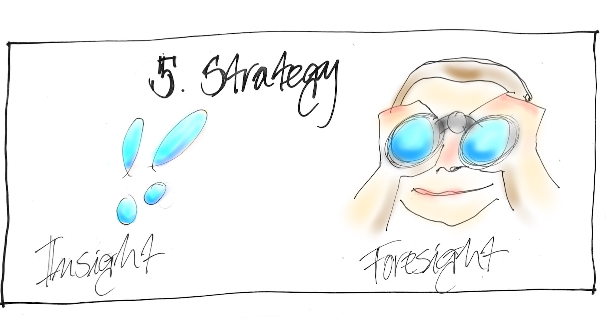

# Lean Planning 
### in 8 simple steps
  
<small>written by Johan Frisk&copy; for LeanBee.se</small>

---

##### this is the total process, let's go through it step-by-step

*** =pnotes

these are some notes

--- &vertical

## How to use this presentation
<small>
There are eight steps to the process, each is illustrated by a drawing. Use 
them to work with a group to define an actionable backlog of strategic items.

 

##### Navigate in these four ways:
1. If you go *horisonally* to the right you will see the eight steps in sequence.
2. If you go *down* on any step you will find a written instruction and,
3. if you hit *'esc'* you will see a navigational view of all the slides.
4. If you press *'s'* anywhere you come to the presenter's window.

</small>

***

## Where should you do the work?

<small>

- Steps 1-3 are very analytical and are best done in a working 
environment away from the office.
- Steps 4-6 are more visionary and free-flowing, they are best done in a 
different environment. Try something like a park, art museum or on a boat.
- Steps 7-8 are administrative and can be done at the office.

</small>

*** =pnotes

these are some notes

--- &vertical

## Step 1: 
##### Open your mind and clear out prejudices

***

## Step1: The "spew-out"

<small>
In any workshop, the first step is to clear everyones mind of prejudices
and focus on the matters at hand. The spew-out is an excellent way of getting
all existing ideas out and "park" them for future use.

 

#### The steps in the spew-out
1. All participants prepare post-it notes individually for 15-30 min.
2. En turn, each participant read out the notes and stick them to board.
3. The facilitator helps the group through a dialogue on the results, finishing
by dot voting.
4. The facilitator holds a retrospective over the exercise.

 

##### All thoughts and ideas in this step will be used in step three, for the SPOT analysis according to this key: 

- Happening and Should happen = Strength,
- Happening and Shouldn't happen = Problems, to be investigated further 
by using Goldratt's [current reality tree](
https://en.wikipedia.org/wiki/Current_reality_tree_\(Theory_of_constraints\)
), 
- Isn't happening and Should happen = Problems, 
- Isn't happening and Shouldn't happen = Strengths.

</small>

*** =pnotes

these are some notes

--- &vertical

## Step 2: 
##### Find the main trunk and branches of the company

***

## Step 2: The Structure
<small>
##### The steps to share and define the structure
1. Divide the group according to market.
2. Have each group prepare a tree for their market.
3. Each market present their findings.
4. A facilitated dialogue to find common observations.
5. A facilitated retrospective over the exercise.

 

##### Parts of the trees
- The fruits in each tree are the customer benefits.
- The benefits hang on product branches.
- The brances are fixed to the main trunk of a core idea.
- The trunk is held in place by root technologies.
- The root system is kept alive by core competencies.

</small>

*** =pnotes

these are some notes

--- &vertical

## Step 3: 
##### Transform everything to opportunities

***
## Step 3: SPOT analysis
The goal of the SPOT analysis is to create a list of opportunities. This list
can then be treated as a strategic backlog

<small>
##### The steps to the SPOT process
1. Populate the board with the observations from the 'spew-out' and 
'structure trees'.
2. Have each participants come up with post-it notes for quadrants on the board
that have fewer than average observations.
3. Populate the board so that it becomes relatively balanced.
4. Facilitated group-exercise to organize the post-its in order of falling 
priority by pair-wise comparison.
5. Facilitated dialogue on identified opportunities.
6. Facilitated retrospective over the work done in  the SPOT analysis.

</small>

*** =pnotes

these are some notes

--- &vertical

## Step 4: 
##### See it in the right context

***

## Step 4: The context
<small>
Creating the context for strategic initiatives. This is done through dialogue 
and reflection in a harmonious atmospere. Get out of the office and maybe take a 
long stroll in nature. Notes can be kept on paper or in a common Google Sheet 
via mobile phones.

 

##### Hindsight - what we should have done differently
- Think back over what happened during the last period, and the periods before. 
- What made you scratch your head and ask, how did this happen?
- What made the sun come out? What did you solve or see more clearly?

 

##### Outsight - what the competition is doing
- What is happening in the industry?
- What are your knowledge and guesses about competitor's plans?
- Are their any technological or legal changes happening?

</small>

*** =pnotes

these are some notes

--- &vertical

## Step 5: 
##### Create a memory of the future

***

## Step 5: Strategy
<small>
Look back onf exercises 2, 3 and 4 and reflect.

##### Insight
Summarize the main insights, list what is new and document on A3:s.

 

##### Foresight
1. Extrapolate from the past and what you think is happening in your markets.
2. Estimate the probabilities of your predictions on a scale from 0-100%.
3. Identify knowledge gaps and risks.

 

Finish the work on this stage with a retrospective session.

</small>

*** =pnotes

these are some notes

--- &vertical

## Step 6: 
##### Create the action backlog

***

## Step 6: Action
<small>
Time to bring it all together and make it possible to execute. A brilliant 
plan in a drawer will always lose to one that is implemented, even if weak.

 

##### Backlog
- Assemble the material from 'opportunities' in step 3 and what you see that needs 
fixing in step 5, plus all other actionable material.

 

##### Prio
- Select the items on the backlog that are both desireable from a custom/user point
of view, financially viable and technically feasible.
- Rank the selected items on [cost of delay](http://www.leadingagile.com/2015/06/an-introduction-to-cost-of-delay/) as 
defined by Don Reinertsen.

 

##### Implement
- Distribute the backlog items in prio order to teams with the adequate 
competence. The best way to start up the work is to ask the team to report 
back on time estimates and acceptance criteria before any major investments.
- Ask the team for frequent demos (sometimes called Integration Events). The 
frequent reports makes it impossible to finish work before feedback, this is 
the best way to ensure that the team is successful. If the team is allowed to 
finish, it is very easy to fall into the trap of defending the work rather than 
accepting valid objections.

 

</small>

*** =pnotes

these are some notes

---

## Step 7: 
##### Start the learning cycle

 <q>When the facts change, I change my mind. What do you do, sir?</q>
  <small>-John Maynard Keynes</small>

<small>
- A Lean planning process takes reality into account. In a standard budget process 
the planning work is so difficult, detailed and time consuming that it cannot 
be repeated until a year later. But, much happens during a year and when things 
change the strategy must adapt.

 

- Install a procedure to revisit and update steps 2 and 4-6 on a regular monthly or 
quarterly basis. The timespan depends on the speed of change in your industry. If 
more frequent updates are necessary the time spent in each step has to be limited.

 

- Take special care to prune the backlog so that it is reasonable in size 
compared to the interval between strategy updates. It does not make sense to 
have a backlog with 18 months of activity if your world changes twice a year.

</small>

*** =pnotes

these are some notes

---

## Step 8: 
##### Invite independent critique
<small>
If the group preparing the strategy could see the flaws in their own reasoning 
they would of course correct the work. Make sure that you get independent 
review and critique of the world view that the team came up with.

 

##### There are two major obstacles that can cloud the judgment of the team
- The first is [cognitive biases](http://en.citizendium.org/wiki/Cognitive_traps_for_intelligence_analysis), such as mirror imaging, anchoring, and confirmation bias. In the scientific method, one first proposes a hypothesis, experiments, then comes to a conclusion as the data allows. In politics, however, most people will read some information, come up with a hypothesis, and then fit any further information into their own hypothesis.
- The second obstacle stems from [organizational biases](http://www.globoforce.com/gfblog/2012/8-cognitive-biases-that-will-make-or-break-your-culture/). Employees become captured by the institutional culture that they experience daily and adopt the personal preferences of their bosses and workplaces.

</small>

*** =pnotes

these are some notes

---

# Thanks!
<small>from all the LeanBees...</small> 

